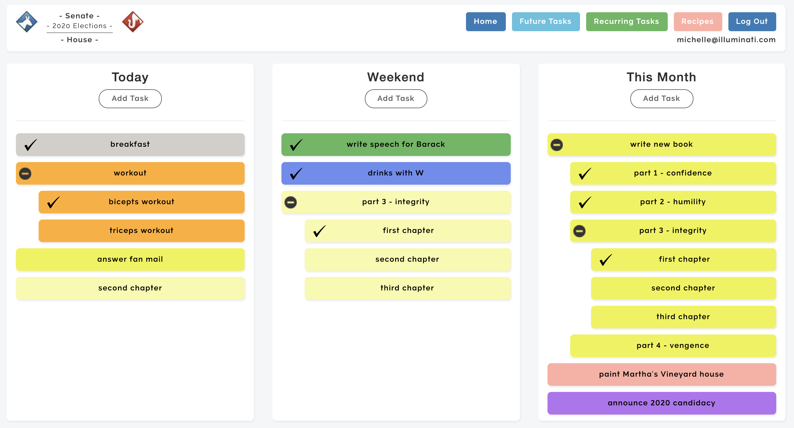
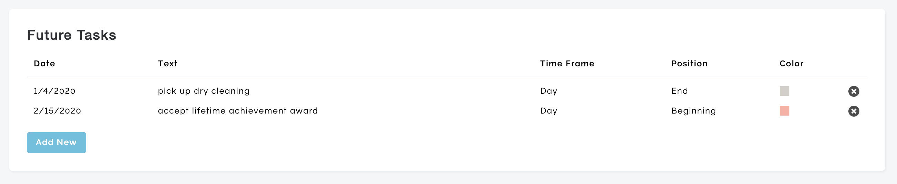
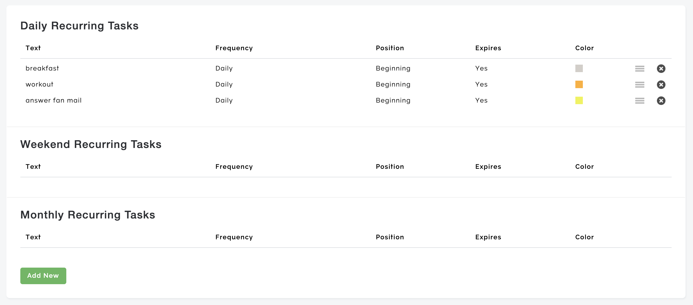

# Task Manager

Create the ultimate to do list, with sub-tasks, color-coding, joint-tasks for multiple users, and more.

## Tasks

Tasks can be created within different timeframes (Day, Weekend, Month, Year, Lifetime). Subtasks can be created, and dragged into shorter timeframes. A subtask for a monthly task can be dragged into the list of tasks for the day, for example.

A task will be marked complete when all of its subtasks are complete.

## Future Tasks

If you have a task you know you'll need to complete in the future, you can schedule it to show up on a specified day.

## Recurring Tasks

You can configure recurring daily, weekly, or monthly tasks. Joint tasks can be assigned to multiple users. If one user completes the task, the other users will see that it has been completed.

